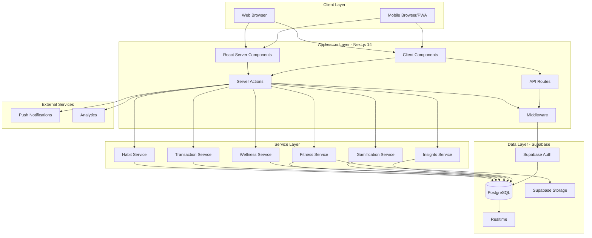
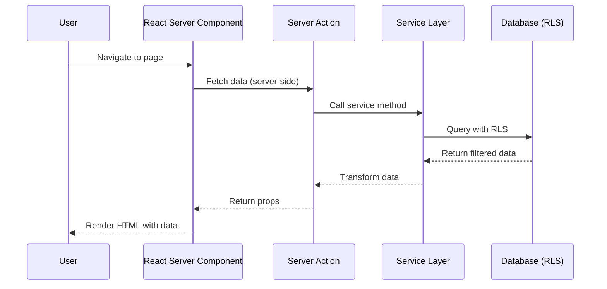
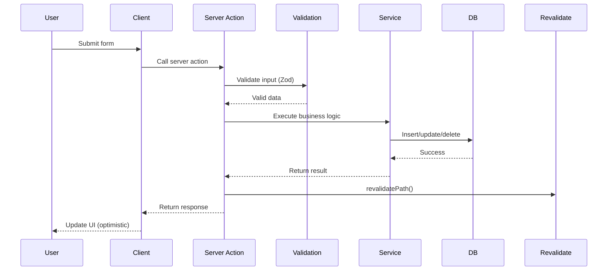
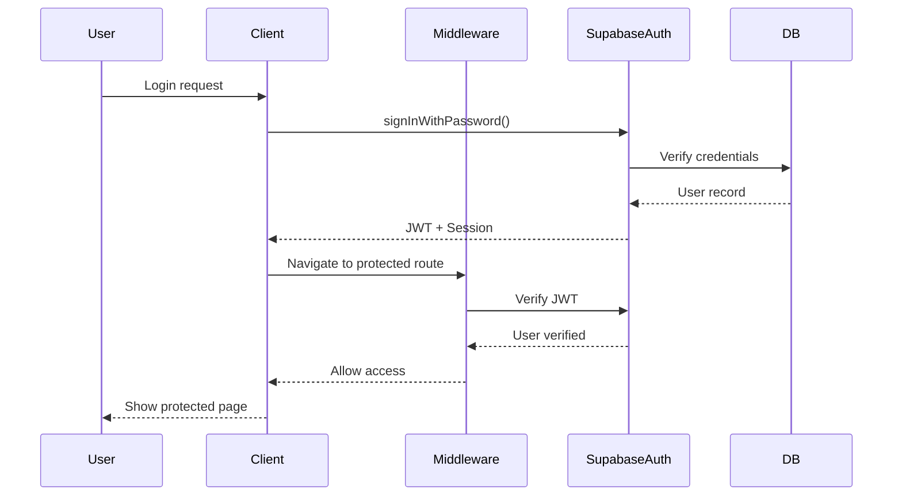
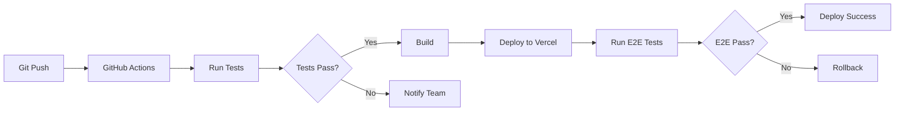

# System Architecture
## LifeGrow - Self Improvement App

---

## 1. Architecture Overview

### Architecture Pattern

**Hybrid Architecture**: Server-Side Rendering (SSR) + Client-Side Interactivity

- **Frontend**: Next.js 14 App Router (React Server Components + Client Components)
- **Backend**: Next.js API Routes + Server Actions
- **Database**: PostgreSQL via Supabase
- **Authentication**: Supabase Auth
- **Storage**: Supabase Storage (progress photos, avatars)
- **Realtime**: Supabase Realtime (future: collaborative features)

---

## 2. System Diagram



---

## 3. Data Flow Architecture

### Read Flow (Data Fetching)



### Write Flow (Mutations)



---

## 4. Authentication Flow



### Session Management

- **JWT Tokens**: Stored in HTTP-only cookies
- **Session Refresh**: Automatic token refresh before expiry
- **Middleware Check**: Every request validates auth state
- **Client-Side**: `useAuth()` hook for auth state
- **Server-Side**: `getUser()` in Server Actions

---

## 5. Database Architecture

### Row Level Security (RLS)

All user data protected by RLS policies:

```sql
-- Example: Users can only see their own habits
CREATE POLICY "Users can view own habits"
  ON habits FOR SELECT
  USING (auth.uid() = user_id);
```

### Data Isolation

- Each user's data completely isolated at DB level
- No application-level filtering needed
- Queries automatically filtered by RLS
- Prevents data leaks even if query is misconfigured

---

## 6. Caching Strategy

### Multi-Level Caching

| Level | Technology | Duration | Use Case |
|-------|------------|----------|----------|
| CDN | Vercel Edge | 1 year | Static assets (JS, CSS, images) |
| Page Cache | Next.js | Revalidate on demand | Public pages (landing) |
| Data Cache | React Cache | Request duration | Deduplication |
| Client Cache | Browser | Session | User preferences |

### Cache Invalidation

- **Mutations**: `revalidatePath()` invalidates specific routes
- **Time-based**: `revalidate: 60` for periodic refresh
- **On-demand**: Webhook triggers cache purge

---

## 7. Scalability Architecture

### Horizontal Scaling

- **Stateless Application**: No server-side session state
- **Database Connection Pooling**: Supabase Pooler (PgBouncer)
- **CDN Distribution**: Global edge network
- **Auto-scaling**: Vercel serverless functions scale automatically

### Performance Targets

| Metric | Target | Measurement |
|--------|--------|-------------|
| Time to First Byte (TTFB) | <200ms | Server response |
| First Contentful Paint (FCP) | <1.5s | Initial render |
| Largest Contentful Paint (LCP) | <2.5s | Main content |
| Cumulative Layout Shift (CLS) | <0.1 | Visual stability |
| First Input Delay (FID) | <100ms | Interactivity |

---

## 8. Deployment Architecture

### Hosting Infrastructure

```
User Request
    ↓
Vercel Edge Network (CDN)
    ↓
Next.js Application (Serverless)
    ↓
Supabase (Database + Auth + Storage)
```

### Environments

| Environment | Purpose | URL |
|-------------|---------|-----|
| Development | Local development | localhost:3000 |
| Preview | PR previews | preview-*.vercel.app |
| Staging | Pre-production testing | staging.lifegrow.app |
| Production | Live application | lifegrow.app |

### CI/CD Pipeline



---

## 9. Security Architecture

See [security.md](./security.md) for detailed security documentation.

### Security Layers

1. **Network Layer**: HTTPS/TLS encryption
2. **Application Layer**: Input validation, CSRF protection
3. **Authentication Layer**: JWT, secure session management
4. **Authorization Layer**: RLS policies, role-based access
5. **Data Layer**: Encryption at rest, encrypted backups

---

## 10. Monitoring & Observability

### Logging

- **Application Logs**: Structured JSON logs
- **Error Tracking**: Sentry for error monitoring
- **Access Logs**: Nginx/Vercel access logs
- **Audit Logs**: User actions (sensitive operations)

### Metrics

| Metric | Tool | Alert Threshold |
|--------|------|-----------------|
| Response Time | Vercel Analytics | >500ms (p95) |
| Error Rate | Sentry | >1% |
| Database CPU | Supabase | >80% |
| Memory Usage | Vercel | >80% |
| API Success Rate | Custom | <99% |

### Alerts

- **Critical**: Page down, database unreachable
- **Warning**: High response time, elevated errors
- **Info**: Deployment success, traffic spikes

---

## 11. Backup & Disaster Recovery

### Database Backups

- **Automated Backups**: Daily full backups (Supabase)
- **Point-in-Time Recovery**: 7-day PITR window
- **Backup Retention**: 30 days
- **Backup Location**: Multi-region storage

### Recovery Time Objectives (RTO)

| Scenario | RTO | RPO |
|----------|-----|-----|
| Application crash | <1 min | 0 (stateless) |
| Database failure | <5 min | <5 min |
| Region outage | <30 min | <15 min |
| Data corruption | <2 hours | <1 day |

---

## 12. Third-Party Integrations

### Current Integrations

| Service | Purpose | Criticality |
|---------|---------|-------------|
| Supabase | Database, Auth, Storage | Critical |
| Vercel | Hosting, Edge Network | Critical |
| Sentry | Error tracking | High |
| PostHog/Mixpanel | Analytics | Medium |

### Future Integrations

- **Wearables**: Apple Health, Google Fit, Fitbit
- **Banking**: Plaid for transaction import
- **AI**: OpenAI for insights and recommendations
- **Notifications**: Firebase Cloud Messaging
- **Email**: Resend for transactional emails

---

## 13. Mobile Strategy

### Progressive Web App (PWA)

**Phase 1**: PWA with app-like experience
- Installable on iOS/Android
- Offline support for core features
- Push notifications
- Native-like UI

**Phase 2**: Native apps (if needed)
- React Native for iOS/Android
- Shared business logic with web
- Native performance for heavy features

---

## 14. Data Migration Strategy

### Schema Versioning

- **Migration Files**: Timestamped SQL files
- **Version Control**: Migrations in Git
- **Rollback Support**: Down migrations for each up migration
- **Testing**: Test migrations on staging first

### Migration Process

1. Write migration SQL
2. Test on local database
3. Deploy to staging
4. Run automated tests
5. Deploy to production during low-traffic window
6. Monitor for errors
7. Rollback plan ready

---

## 15. Future Architecture Considerations

### Microservices Evolution

If scale requires:
- **Insights Service**: Separate service for AI/ML
- **Notification Service**: Dedicated push notification service
- **Analytics Service**: Real-time analytics processing

### Event-Driven Architecture

Consider event bus for:
- Cross-module communication
- Async processing (reports, exports)
- Third-party webhooks
- Real-time features (collaborative habits)

---

## Document History

| Version | Date | Author | Changes |
|---------|------|--------|---------|
| 1.0 | 2026-01-07 | Architecture Team | Initial system architecture |
