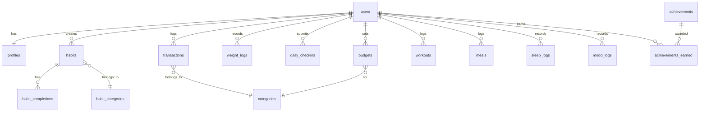

# Database Schema
## LifeGrow - Self Improvement App

---

## 1. Database Overview

**Database**: PostgreSQL 15+
**ORM**: Drizzle ORM
**BaaS Provider**: Supabase
**Features**: Row Level Security (RLS), Real-time subscriptions, Auto-generated types

---

## 2. Schema Diagram



---

## 3. Core Tables

### 3.1 Users & Profiles

#### `auth.users` (Supabase Auth)
Managed by Supabase Auth, contains authentication data.

#### `profiles`
Extended user profile information.

```sql
CREATE TABLE profiles (
  id UUID PRIMARY KEY REFERENCES auth.users(id) ON DELETE CASCADE,
  email TEXT NOT NULL,
  full_name TEXT,
  avatar_url TEXT,

  -- Preferences
  timezone TEXT DEFAULT 'UTC',
  language TEXT DEFAULT 'en',
  currency TEXT DEFAULT 'USD',
  theme TEXT DEFAULT 'dark',

  -- Gamification
  total_points INTEGER DEFAULT 0,
  current_level TEXT DEFAULT 'Beginner',

  -- Onboarding
  onboarding_completed BOOLEAN DEFAULT FALSE,
  goals JSONB DEFAULT '[]',

  -- Timestamps
  created_at TIMESTAMPTZ DEFAULT NOW(),
  updated_at TIMESTAMPTZ DEFAULT NOW()
);

CREATE INDEX idx_profiles_level ON profiles(current_level);
```

---

### 3.2 Habits Module

#### `habit_categories`

```sql
CREATE TABLE habit_categories (
  id UUID PRIMARY KEY DEFAULT gen_random_uuid(),
  name TEXT NOT NULL,
  slug TEXT UNIQUE NOT NULL,
  icon TEXT,
  color TEXT,
  description TEXT,
  is_system BOOLEAN DEFAULT FALSE,
  created_at TIMESTAMPTZ DEFAULT NOW()
);

-- Insert default categories
INSERT INTO habit_categories (name, slug, icon, is_system) VALUES
  ('Health', 'health', '🏃', TRUE),
  ('Productivity', 'productivity', '💼', TRUE),
  ('Mindfulness', 'mindfulness', '🧘', TRUE),
  ('Learning', 'learning', '📚', TRUE),
  ('Social', 'social', '👥', TRUE),
  ('Finance', 'finance', '💰', TRUE);
```

#### `habits`

```sql
CREATE TABLE habits (
  id UUID PRIMARY KEY DEFAULT gen_random_uuid(),
  user_id UUID NOT NULL REFERENCES auth.users(id) ON DELETE CASCADE,
  category_id UUID REFERENCES habit_categories(id),

  -- Basic info
  name TEXT NOT NULL,
  description TEXT,
  icon TEXT,

  -- Scheduling
  schedule_type TEXT NOT NULL DEFAULT 'daily', -- daily, weekly, custom
  schedule_days INTEGER[] DEFAULT '{0,1,2,3,4,5,6}', -- 0=Sun, 6=Sat
  reminder_enabled BOOLEAN DEFAULT FALSE,
  reminder_time TIME,

  -- Tracking
  current_streak INTEGER DEFAULT 0,
  longest_streak INTEGER DEFAULT 0,
  total_completions INTEGER DEFAULT 0,

  -- Status
  is_active BOOLEAN DEFAULT TRUE,
  archived_at TIMESTAMPTZ,

  -- Timestamps
  created_at TIMESTAMPTZ DEFAULT NOW(),
  updated_at TIMESTAMPTZ DEFAULT NOW()
);

CREATE INDEX idx_habits_user ON habits(user_id);
CREATE INDEX idx_habits_active ON habits(user_id, is_active);
CREATE INDEX idx_habits_category ON habits(category_id);
```

#### `habit_completions`

```sql
CREATE TABLE habit_completions (
  id UUID PRIMARY KEY DEFAULT gen_random_uuid(),
  habit_id UUID NOT NULL REFERENCES habits(id) ON DELETE CASCADE,
  completed_date DATE NOT NULL,
  notes TEXT,
  created_at TIMESTAMPTZ DEFAULT NOW(),

  UNIQUE(habit_id, completed_date)
);

CREATE INDEX idx_completions_habit ON habit_completions(habit_id);
CREATE INDEX idx_completions_date ON habit_completions(completed_date DESC);
CREATE INDEX idx_completions_habit_date ON habit_completions(habit_id, completed_date DESC);
```

---

### 3.3 Cashflow Module

#### `categories`

```sql
CREATE TABLE categories (
  id UUID PRIMARY KEY DEFAULT gen_random_uuid(),
  user_id UUID NOT NULL REFERENCES auth.users(id) ON DELETE CASCADE,
  name TEXT NOT NULL,
  type TEXT NOT NULL CHECK (type IN ('income', 'expense')),
  icon TEXT,
  color TEXT,
  is_system BOOLEAN DEFAULT FALSE,
  created_at TIMESTAMPTZ DEFAULT NOW(),

  UNIQUE(user_id, name, type)
);

CREATE INDEX idx_categories_user_type ON categories(user_id, type);

-- Default categories
INSERT INTO categories (user_id, name, type, icon, is_system)
SELECT id, 'Salary', 'income', '💼', TRUE FROM auth.users
UNION ALL
SELECT id, 'Food', 'expense', '🍔', TRUE FROM auth.users
UNION ALL
SELECT id, 'Transport', 'expense', '🚗', TRUE FROM auth.users;
```

#### `transactions`

```sql
CREATE TABLE transactions (
  id UUID PRIMARY KEY DEFAULT gen_random_uuid(),
  user_id UUID NOT NULL REFERENCES auth.users(id) ON DELETE CASCADE,
  category_id UUID NOT NULL REFERENCES categories(id),

  -- Transaction details
  amount DECIMAL(12, 2) NOT NULL CHECK (amount > 0),
  type TEXT NOT NULL CHECK (type IN ('income', 'expense')),
  description TEXT,
  transaction_date DATE NOT NULL DEFAULT CURRENT_DATE,

  -- Recurring
  is_recurring BOOLEAN DEFAULT FALSE,
  recurrence_rule TEXT, -- RRULE format

  -- Metadata
  tags TEXT[],
  notes TEXT,

  created_at TIMESTAMPTZ DEFAULT NOW(),
  updated_at TIMESTAMPTZ DEFAULT NOW()
);

CREATE INDEX idx_transactions_user ON transactions(user_id);
CREATE INDEX idx_transactions_date ON transactions(transaction_date DESC);
CREATE INDEX idx_transactions_user_date ON transactions(user_id, transaction_date DESC);
CREATE INDEX idx_transactions_category ON transactions(category_id);
CREATE INDEX idx_transactions_type ON transactions(user_id, type);
```

#### `budgets`

```sql
CREATE TABLE budgets (
  id UUID PRIMARY KEY DEFAULT gen_random_uuid(),
  user_id UUID NOT NULL REFERENCES auth.users(id) ON DELETE CASCADE,
  category_id UUID NOT NULL REFERENCES categories(id),

  -- Budget details
  amount DECIMAL(12, 2) NOT NULL CHECK (amount > 0),
  month DATE NOT NULL, -- First day of month

  -- Alerts
  alert_80_sent BOOLEAN DEFAULT FALSE,
  alert_100_sent BOOLEAN DEFAULT FALSE,

  created_at TIMESTAMPTZ DEFAULT NOW(),
  updated_at TIMESTAMPTZ DEFAULT NOW(),

  UNIQUE(user_id, category_id, month)
);

CREATE INDEX idx_budgets_user_month ON budgets(user_id, month DESC);
```

#### `financial_goals`

```sql
CREATE TABLE financial_goals (
  id UUID PRIMARY KEY DEFAULT gen_random_uuid(),
  user_id UUID NOT NULL REFERENCES auth.users(id) ON DELETE CASCADE,

  name TEXT NOT NULL,
  target_amount DECIMAL(12, 2) NOT NULL,
  current_amount DECIMAL(12, 2) DEFAULT 0,
  target_date DATE,

  status TEXT DEFAULT 'active' CHECK (status IN ('active', 'completed', 'cancelled')),

  created_at TIMESTAMPTZ DEFAULT NOW(),
  updated_at TIMESTAMPTZ DEFAULT NOW()
);

CREATE INDEX idx_goals_user_status ON financial_goals(user_id, status);
```

---

### 3.4 Fitness Module

#### `weight_logs`

```sql
CREATE TABLE weight_logs (
  id UUID PRIMARY KEY DEFAULT gen_random_uuid(),
  user_id UUID NOT NULL REFERENCES auth.users(id) ON DELETE CASCADE,

  weight DECIMAL(5, 2) NOT NULL CHECK (weight > 0),
  unit TEXT DEFAULT 'kg' CHECK (unit IN ('kg', 'lbs')),
  log_date DATE NOT NULL DEFAULT CURRENT_DATE,
  notes TEXT,

  created_at TIMESTAMPTZ DEFAULT NOW(),

  UNIQUE(user_id, log_date)
);

CREATE INDEX idx_weight_user_date ON weight_logs(user_id, log_date DESC);
```

#### `body_measurements`

```sql
CREATE TABLE body_measurements (
  id UUID PRIMARY KEY DEFAULT gen_random_uuid(),
  user_id UUID NOT NULL REFERENCES auth.users(id) ON DELETE CASCADE,

  measurement_date DATE NOT NULL DEFAULT CURRENT_DATE,

  -- Measurements in cm
  chest DECIMAL(5, 2),
  waist DECIMAL(5, 2),
  hips DECIMAL(5, 2),
  bicep_left DECIMAL(5, 2),
  bicep_right DECIMAL(5, 2),
  thigh_left DECIMAL(5, 2),
  thigh_right DECIMAL(5, 2),

  notes TEXT,
  created_at TIMESTAMPTZ DEFAULT NOW(),

  UNIQUE(user_id, measurement_date)
);

CREATE INDEX idx_measurements_user_date ON body_measurements(user_id, measurement_date DESC);
```

#### `workouts`

```sql
CREATE TABLE workouts (
  id UUID PRIMARY KEY DEFAULT gen_random_uuid(),
  user_id UUID NOT NULL REFERENCES auth.users(id) ON DELETE CASCADE,

  name TEXT NOT NULL,
  workout_type TEXT, -- strength, cardio, flexibility
  duration_minutes INTEGER,
  calories_burned INTEGER,
  workout_date DATE NOT NULL DEFAULT CURRENT_DATE,

  exercises JSONB, -- Array of exercises with sets/reps
  notes TEXT,

  created_at TIMESTAMPTZ DEFAULT NOW()
);

CREATE INDEX idx_workouts_user_date ON workouts(user_id, workout_date DESC);
```

#### `meals`

```sql
CREATE TABLE meals (
  id UUID PRIMARY KEY DEFAULT gen_random_uuid(),
  user_id UUID NOT NULL REFERENCES auth.users(id) ON DELETE CASCADE,

  meal_type TEXT NOT NULL CHECK (meal_type IN ('breakfast', 'lunch', 'dinner', 'snack')),
  meal_date DATE NOT NULL DEFAULT CURRENT_DATE,
  meal_time TIME,

  -- Nutrition
  calories INTEGER,
  protein DECIMAL(6, 2),
  carbs DECIMAL(6, 2),
  fats DECIMAL(6, 2),

  description TEXT,
  foods JSONB, -- Array of foods

  created_at TIMESTAMPTZ DEFAULT NOW()
);

CREATE INDEX idx_meals_user_date ON meals(user_id, meal_date DESC);
```

#### `fitness_goals`

```sql
CREATE TABLE fitness_goals (
  id UUID PRIMARY KEY DEFAULT gen_random_uuid(),
  user_id UUID NOT NULL REFERENCES auth.users(id) ON DELETE CASCADE,

  goal_type TEXT NOT NULL CHECK (goal_type IN ('weight_loss', 'weight_gain', 'maintain', 'muscle_gain')),

  -- Weight goals
  start_weight DECIMAL(5, 2),
  target_weight DECIMAL(5, 2),
  target_date DATE,

  -- Nutrition targets
  daily_calories INTEGER,
  daily_protein DECIMAL(6, 2),

  status TEXT DEFAULT 'active',

  created_at TIMESTAMPTZ DEFAULT NOW(),
  updated_at TIMESTAMPTZ DEFAULT NOW()
);

CREATE INDEX idx_fitness_goals_user ON fitness_goals(user_id);
```

---

### 3.5 Wellness Module

#### `daily_checkins`

```sql
CREATE TABLE daily_checkins (
  id UUID PRIMARY KEY DEFAULT gen_random_uuid(),
  user_id UUID NOT NULL REFERENCES auth.users(id) ON DELETE CASCADE,

  checkin_date DATE NOT NULL DEFAULT CURRENT_DATE,

  -- Scores (1-10)
  mood INTEGER CHECK (mood BETWEEN 1 AND 10),
  energy INTEGER CHECK (energy BETWEEN 1 AND 10),
  stress INTEGER CHECK (stress BETWEEN 1 AND 10),

  -- Activity
  steps INTEGER DEFAULT 0,
  water_intake INTEGER DEFAULT 0, -- Glasses
  exercise_minutes INTEGER DEFAULT 0,

  -- Journal
  gratitude TEXT,
  notes TEXT,

  created_at TIMESTAMPTZ DEFAULT NOW(),
  updated_at TIMESTAMPTZ DEFAULT NOW(),

  UNIQUE(user_id, checkin_date)
);

CREATE INDEX idx_checkins_user_date ON daily_checkins(user_id, checkin_date DESC);
```

#### `sleep_logs`

```sql
CREATE TABLE sleep_logs (
  id UUID PRIMARY KEY DEFAULT gen_random_uuid(),
  user_id UUID NOT NULL REFERENCES auth.users(id) ON DELETE CASCADE,

  sleep_date DATE NOT NULL, -- Date of sleep (night)

  -- Sleep data
  bedtime TIMESTAMPTZ,
  wake_time TIMESTAMPTZ,
  duration_hours DECIMAL(4, 2),

  -- Quality (1-10)
  quality INTEGER CHECK (quality BETWEEN 1 AND 10),

  -- Details
  interruptions INTEGER DEFAULT 0,
  dream_recall BOOLEAN DEFAULT FALSE,
  notes TEXT,

  created_at TIMESTAMPTZ DEFAULT NOW(),

  UNIQUE(user_id, sleep_date)
);

CREATE INDEX idx_sleep_user_date ON sleep_logs(user_id, sleep_date DESC);
```

#### `mood_logs`

```sql
CREATE TABLE mood_logs (
  id UUID PRIMARY KEY DEFAULT gen_random_uuid(),
  user_id UUID NOT NULL REFERENCES auth.users(id) ON DELETE CASCADE,

  log_date DATE NOT NULL DEFAULT CURRENT_DATE,
  log_time TIME DEFAULT NOW(),

  -- Mood data
  mood_score INTEGER NOT NULL CHECK (mood_score BETWEEN 1 AND 10),
  mood_tags TEXT[], -- happy, sad, anxious, calm, etc.

  -- Context
  triggers TEXT,
  notes TEXT,

  created_at TIMESTAMPTZ DEFAULT NOW()
);

CREATE INDEX idx_mood_user_date ON mood_logs(user_id, log_date DESC);
```

#### `meditation_sessions`

```sql
CREATE TABLE meditation_sessions (
  id UUID PRIMARY KEY DEFAULT gen_random_uuid(),
  user_id UUID NOT NULL REFERENCES auth.users(id) ON DELETE CASCADE,

  session_date DATE NOT NULL DEFAULT CURRENT_DATE,
  duration_minutes INTEGER NOT NULL,
  meditation_type TEXT, -- mindfulness, guided, breathing

  notes TEXT,
  created_at TIMESTAMPTZ DEFAULT NOW()
);

CREATE INDEX idx_meditation_user ON meditation_sessions(user_id, session_date DESC);
```

#### `wellness_scores`

```sql
CREATE TABLE wellness_scores (
  id UUID PRIMARY KEY DEFAULT gen_random_uuid(),
  user_id UUID NOT NULL REFERENCES auth.users(id) ON DELETE CASCADE,

  score_date DATE NOT NULL DEFAULT CURRENT_DATE,

  -- Overall score (0-100)
  total_score INTEGER CHECK (total_score BETWEEN 0 AND 100),

  -- Component scores
  sleep_score DECIMAL(5, 2),
  mood_score DECIMAL(5, 2),
  stress_score DECIMAL(5, 2),
  activity_score DECIMAL(5, 2),
  hydration_score DECIMAL(5, 2),
  habits_score DECIMAL(5, 2),

  created_at TIMESTAMPTZ DEFAULT NOW(),

  UNIQUE(user_id, score_date)
);

CREATE INDEX idx_wellness_user_date ON wellness_scores(user_id, score_date DESC);
```

---

### 3.6 Gamification

#### `achievements`

```sql
CREATE TABLE achievements (
  id UUID PRIMARY KEY DEFAULT gen_random_uuid(),

  name TEXT NOT NULL UNIQUE,
  description TEXT,
  icon TEXT,
  category TEXT, -- habits, fitness, cashflow, wellness

  -- Requirements
  requirement_type TEXT NOT NULL, -- streak, total, consecutive
  requirement_value INTEGER NOT NULL,

  -- Rewards
  points INTEGER DEFAULT 0,
  badge_tier TEXT, -- bronze, silver, gold, platinum

  created_at TIMESTAMPTZ DEFAULT NOW()
);

INSERT INTO achievements (name, description, icon, category, requirement_type, requirement_value, points) VALUES
  ('First Steps', 'Complete your profile', '🎯', 'general', 'total', 1, 25),
  ('Habit Hero', '30-day streak', '🔥', 'habits', 'streak', 30, 200),
  ('Money Master', 'Stay under budget 3 months', '💰', 'cashflow', 'consecutive', 3, 300),
  ('Weight Warrior', 'Reach weight goal', '⚖️', 'fitness', 'total', 1, 500),
  ('Zen Master', '30 days of meditation', '🧘', 'wellness', 'total', 30, 200);
```

#### `achievements_earned`

```sql
CREATE TABLE achievements_earned (
  id UUID PRIMARY KEY DEFAULT gen_random_uuid(),
  user_id UUID NOT NULL REFERENCES auth.users(id) ON DELETE CASCADE,
  achievement_id UUID NOT NULL REFERENCES achievements(id),

  earned_at TIMESTAMPTZ DEFAULT NOW(),

  UNIQUE(user_id, achievement_id)
);

CREATE INDEX idx_earned_user ON achievements_earned(user_id);
```

---

## 4. Row Level Security (RLS)

Enable RLS on all user tables:

```sql
ALTER TABLE profiles ENABLE ROW LEVEL SECURITY;
ALTER TABLE habits ENABLE ROW LEVEL SECURITY;
ALTER TABLE habit_completions ENABLE ROW LEVEL SECURITY;
ALTER TABLE transactions ENABLE ROW LEVEL SECURITY;
ALTER TABLE weight_logs ENABLE ROW LEVEL SECURITY;
ALTER TABLE daily_checkins ENABLE ROW LEVEL SECURITY;
-- ... enable for all user-owned tables
```

### RLS Policies

```sql
-- Profiles: Users can only see/edit their own profile
CREATE POLICY "Users can view own profile"
  ON profiles FOR SELECT
  USING (auth.uid() = id);

CREATE POLICY "Users can update own profile"
  ON profiles FOR UPDATE
  USING (auth.uid() = id);

-- Habits: Users own their habits
CREATE POLICY "Users can view own habits"
  ON habits FOR SELECT
  USING (auth.uid() = user_id);

CREATE POLICY "Users can insert own habits"
  ON habits FOR INSERT
  WITH CHECK (auth.uid() = user_id);

CREATE POLICY "Users can update own habits"
  ON habits FOR UPDATE
  USING (auth.uid() = user_id);

CREATE POLICY "Users can delete own habits"
  ON habits FOR DELETE
  USING (auth.uid() = user_id);

-- Apply similar policies to all user-owned tables
```

---

## 5. Indexes Summary

| Table | Index | Purpose |
|-------|-------|---------|
| `habits` | `user_id, is_active` | Fast active habits lookup |
| `habit_completions` | `habit_id, completed_date DESC` | Streak calculations |
| `transactions` | `user_id, transaction_date DESC` | Monthly summaries |
| `weight_logs` | `user_id, log_date DESC` | Weight trends |
| `daily_checkins` | `user_id, checkin_date DESC` | Wellness scores |
| `sleep_logs` | `user_id, sleep_date DESC` | Sleep analysis |

---

## 6. Triggers & Functions

### Auto-update timestamp

```sql
CREATE OR REPLACE FUNCTION update_updated_at()
RETURNS TRIGGER AS $$
BEGIN
  NEW.updated_at = NOW();
  RETURN NEW;
END;
$$ LANGUAGE plpgsql;

CREATE TRIGGER habits_updated_at
  BEFORE UPDATE ON habits
  FOR EACH ROW
  EXECUTE FUNCTION update_updated_at();

-- Apply to all tables with updated_at
```

### Auto-create profile on signup

```sql
CREATE OR REPLACE FUNCTION create_profile_for_user()
RETURNS TRIGGER AS $$
BEGIN
  INSERT INTO profiles (id, email, full_name)
  VALUES (NEW.id, NEW.email, NEW.raw_user_meta_data->>'full_name');
  RETURN NEW;
END;
$$ LANGUAGE plpgsql SECURITY DEFINER;

CREATE TRIGGER on_auth_user_created
  AFTER INSERT ON auth.users
  FOR EACH ROW
  EXECUTE FUNCTION create_profile_for_user();
```

---

## 7. Views

### User Dashboard Summary

```sql
CREATE VIEW user_dashboard_summary AS
SELECT
  u.id as user_id,
  p.total_points,
  p.current_level,

  -- Habits
  COUNT(DISTINCT h.id) FILTER (WHERE h.is_active) as active_habits,
  COUNT(DISTINCT hc.id) FILTER (WHERE hc.completed_date = CURRENT_DATE) as today_completed,

  -- Cashflow this month
  SUM(t.amount) FILTER (WHERE t.type = 'income' AND t.transaction_date >= date_trunc('month', CURRENT_DATE)) as monthly_income,
  SUM(t.amount) FILTER (WHERE t.type = 'expense' AND t.transaction_date >= date_trunc('month', CURRENT_DATE)) as monthly_expense,

  -- Latest weight
  (SELECT weight FROM weight_logs WHERE user_id = u.id ORDER BY log_date DESC LIMIT 1) as current_weight,

  -- Latest wellness score
  (SELECT total_score FROM wellness_scores WHERE user_id = u.id ORDER BY score_date DESC LIMIT 1) as wellness_score

FROM auth.users u
LEFT JOIN profiles p ON u.id = p.id
LEFT JOIN habits h ON u.id = h.user_id
LEFT JOIN habit_completions hc ON h.id = hc.habit_id
LEFT JOIN transactions t ON u.id = t.user_id
GROUP BY u.id, p.total_points, p.current_level;
```

---

## Document History

| Version | Date | Author |
|---------|------|--------|
| 1.0 | 2026-01-07 | Engineering Team |
