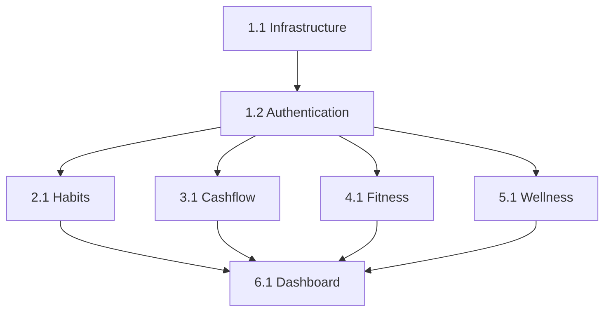

# LifeGrow User Stories Index

## Story Organization

Stories are organized by module following the PRD roadmap. Each story follows the BMAD™ Core format with complete acceptance criteria, tasks, and technical specifications.

---

## Phase 1: Foundation (Stories 1.x)

### [Story 1.1: Project Infrastructure Setup](./1.1-infrastructure-setup.md)
**Status**: PENDING 🔄
**Epic**: Foundation
**Complexity**: Medium

Set up Next.js 14, Supabase, PostgreSQL, Drizzle ORM, TypeScript, and deployment pipeline.

**Key Deliverables**:
- Next.js 14+ project with App Router
- Supabase project with PostgreSQL
- Drizzle ORM configuration
- Vercel deployment pipeline

---

### [Story 1.2: Authentication & User Management](./1.2-authentication-user-management.md)
**Status**: PENDING 🔄
**Epic**: Foundation
**Complexity**: High

Implement Supabase Auth with registration, login, profile management, and Row Level Security.

**Key Deliverables**:
- Email/password authentication
- User registration with verification
- Profile management page
- RLS policies on all user tables

---

## Phase 2: Core Modules (Stories 2.x - 5.x)

### [Story 2.1: Habit Tracker Module - Core Features](./2.1-habit-tracker-core.md)
**Status**: PENDING 🔄
**Epic**: Habits
**Complexity**: High

Build habit creation, tracking, completion, and streak calculation with gamification integration.

**Key Deliverables**:
- Habit CRUD operations
- Daily completion tracking
- Streak calculation algorithm
- Habit calendar view
- Points integration (+10 per habit)

---

### [Story 3.1: Cashflow Module - Transaction Tracking & Budgets](./3.1-cashflow-transactions-budgets.md)
**Status**: PENDING 🔄
**Epic**: Cashflow
**Complexity**: High

Implement transaction logging, category management, monthly budgets, and budget alerts.

**Key Deliverables**:
- Quick transaction entry (<30 seconds)
- Category management (income/expense)
- Monthly budget setting
- Budget alerts (80%, 100%)
- Monthly summary dashboard
- Points integration (+5 per transaction)

---

### [Story 4.1: Fitness Module - Weight & Workout Tracking](./4.1-fitness-weight-workouts.md)
**Status**: PENDING 🔄
**Epic**: Fitness
**Complexity**: High

Track weight with BMI calculation, log workouts, monitor nutrition, and set fitness goals.

**Key Deliverables**:
- Weight logging with trend chart
- BMI auto-calculation
- Fitness goal setting (loss/gain/maintain/muscle)
- Workout logging with exercises
- Meal logging with macros
- Progress photo upload
- Points integration (+10 weight, +25 workout)

---

### [Story 5.1: Wellness Module - Daily Check-ins & Sleep Tracking](./5.1-wellness-checkins-sleep.md)
**Status**: PENDING 🔄
**Epic**: Wellness
**Complexity**: High

Implement daily check-ins, sleep tracking, mood logging, and wellness score calculation.

**Key Deliverables**:
- Daily check-in (mood, energy, stress, steps, water)
- Sleep logging (bedtime, wake time, quality)
- Gratitude journal
- Wellness score algorithm (0-100, weighted)
- Wellness trend charts
- Points integration (+15 per check-in)

---

## Phase 3: Integration & Insights (Stories 6.x)

### [Story 6.1: Dashboard & Gamification System](./6.1-dashboard-gamification.md)
**Status**: PENDING 🔄
**Epic**: Integration
**Complexity**: Very High

Create unified dashboard, points/level system, achievements, and cross-module insights.

**Key Deliverables**:
- Unified dashboard with all module data
- Quick actions (FAB)
- Points system (all activities)
- 7-level progression (Beginner → Legend)
- Achievement system (badges, unlocks)
- Cross-module correlation insights
- Recommendation engine

---

## Story Status Overview

| Status | Count | Stories |
|--------|-------|---------|
| PENDING | 7 | 1.1, 1.2, 2.1, 3.1, 4.1, 5.1, 6.1 |
| IN PROGRESS | 0 | - |
| COMPLETED | 0 | - |

---

## Technical Dependencies

**Dependency Rules**:
1. Infrastructure (1.1) must be completed first
2. Authentication (1.2) depends on Infrastructure
3. All module stories (2.1-5.1) depend on Authentication
4. Dashboard (6.1) depends on all modules

---

## Complexity Breakdown

| Complexity | Story Count | Stories |
|------------|-------------|---------|
| Medium | 1 | 1.1 |
| High | 5 | 1.2, 2.1, 3.1, 4.1, 5.1 |
| Very High | 1 | 6.1 |

---

## Epic Summary

| Epic | Stories | Status |
|------|---------|--------|
| Foundation | 1.1, 1.2 | Not Started |
| Habits | 2.1 | Not Started |
| Cashflow | 3.1 | Not Started |
| Fitness | 4.1 | Not Started |
| Wellness | 5.1 | Not Started |
| Integration | 6.1 | Not Started |

---

## Estimated Timeline

Based on complexity and dependencies:

- **Phase 1 (Foundation)**: 2-3 weeks
  - Story 1.1: 1 week
  - Story 1.2: 1-2 weeks

- **Phase 2 (Core Modules)**: 8-10 weeks
  - Story 2.1 (Habits): 2 weeks
  - Story 3.1 (Cashflow): 2-3 weeks
  - Story 4.1 (Fitness): 2 weeks
  - Story 5.1 (Wellness): 2 weeks

- **Phase 3 (Integration)**: 3-4 weeks
  - Story 6.1 (Dashboard): 3-4 weeks

**Total**: 13-17 weeks for MVP

---

## Future Stories (Phase 4+)

Potential future stories based on PRD:
- 2.2: Habit Templates & Stacking
- 2.3: Habit Sharing & Accountability
- 3.2: Financial Goals & Savings Tracker
- 3.3: Recurring Transactions & Auto-categorization
- 4.2: Exercise Library & Workout Plans
- 4.3: Progress Photos Gallery
- 5.2: Meditation Timer & Guided Sessions
- 5.3: Wearable Integrations (Apple Health, Fitbit)
- 6.2: AI-Powered Recommendations
- 6.3: Social Features & Challenges
- 7.1: Premium Features & Subscriptions
- 7.2: Data Export & API Access

---

## Documentation References

All stories reference the following documentation:
- [PRD.md](../PRD.md) - Product Requirements
- [architecture.md](../architecture .md) - System Architecture
- [backend.md](../backend.md) - Backend Structure
- [frontend.md](../frontend.md) - Frontend Components
- [database.md](../database.md) - Database Schema
- [api.md](../api.md) - API Specifications
- [security.md](../security.md) - Security Requirements

---

## Story Format

Each story follows the BMAD™ Core format:
- Status indicator
- User story ("As a/I want/so that")
- Acceptance Criteria (numbered, testable)
- Tasks/Subtasks (organized, checkbox format)
- Dev Notes (data models, tech stack, file locations, constraints)
- Testing section
- Change Log
- Dev Agent Record (populated during implementation)
- QA Results (populated after QA review)

---

**Last Updated**: 2026-01-07
**Total Stories**: 7
**Stories Completed**: 0
**Current Phase**: Phase 1 - Foundation
